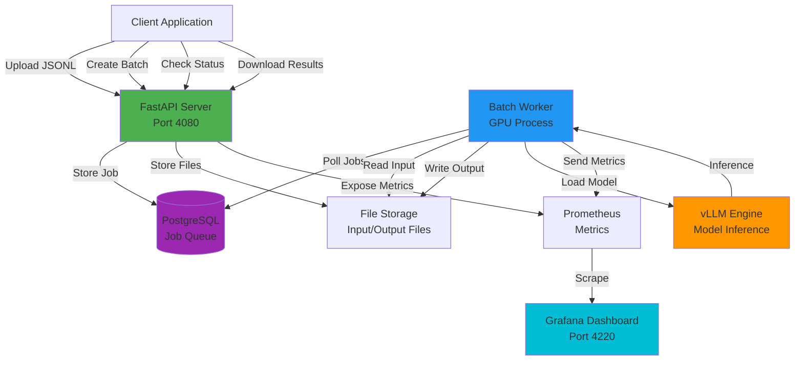
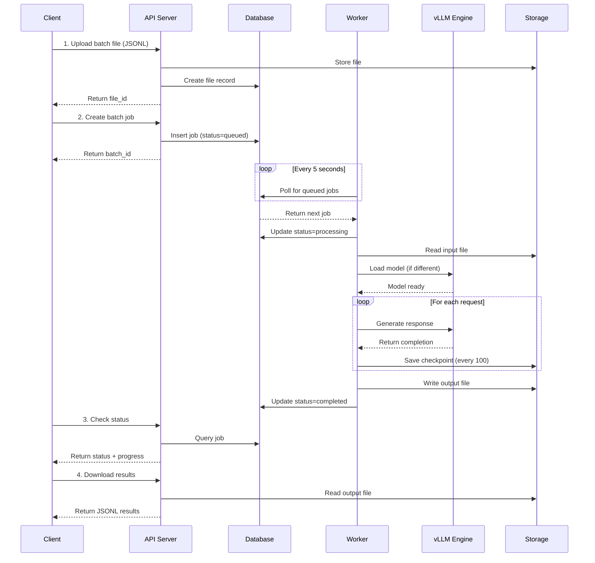

# 🏗️ Architecture

**vLLM Batch Server** - OpenAI-compatible batch processing for local GPUs with integrated data curation

---

## 🎯 Overview

vLLM Batch Server is a production-ready, self-hosted batch inference system that provides:
- **OpenAI-compatible API** - Drop-in replacement for OpenAI Batch API
- **Consumer GPU optimization** - Runs on RTX 4080 16GB (not just 24GB+ GPUs)
- **Integrated data curation** - Label Studio integration for training data creation
- **Production monitoring** - Prometheus + Grafana + Sentry
- **Plugin architecture** - Extensible result handlers

---

## 📊 System Architecture

### **High-Level Architecture**



### **Data Flow**



### **Monorepo Structure**

```
vllm-batch-server/              (Single repo, public on GitHub)
├── core/                       ✅ Public (open source, Apache 2.0)
│   ├── batch_app/              # Batch processing engine
│   ├── result_handlers/        # Plugin system
│   ├── config.py               # Configuration
│   ├── tests/                  # Test suite
│   └── README.md               # Open source docs
│
├── integrations/               ✅ Private (gitignored)
│   ├── examples/               # Public integration examples
│   └── [your-app]/             # Application-specific code
│       ├── schemas/            # Custom schemas
│       ├── curation_app/       # Curation UI/API (optional)
│       └── tests/              # Integration tests
│
├── monitoring/                 # Prometheus, Grafana, Loki
├── docker/                     # Docker Compose configs
├── docs/                       # Documentation
└── README.md                   # Main project README
```

**Design Decision:** Monorepo with public/private split
- ✅ Single source of truth (zero code duplication)
- ✅ Clear separation (core/ vs integrations/)
- ✅ Easy to contribute (just edit core/)
- ✅ Low maintenance (fixes apply once)
- ✅ Future-proof (can extract to PyPI package later)

---

## 🧩 Core Components

### **1. Batch API Server** (`core/batch_app/api_server.py`)

**Port:** 4080  
**Purpose:** OpenAI-compatible batch processing endpoint

**Features:**
- OpenAI Batch API compatibility
- File upload/download (JSONL)
- Job queue management
- Webhook notifications
- GPU health checks
- Rate limiting (10/min for batches, 20/min for files)
- Request tracing with correlation IDs
- Prometheus metrics export

**Database:** PostgreSQL (production-grade, migrated from SQLite)

**API Endpoints:**
```
POST   /v1/files                 # Upload input file
POST   /v1/batches               # Create batch job
GET    /v1/batches/{id}          # Get batch status
POST   /v1/batches/{id}/cancel   # Cancel batch
GET    /v1/files/{id}/content    # Download results
GET    /metrics                  # Prometheus metrics
GET    /health                   # Health check
```

### **2. Batch Worker** (`core/batch_app/worker.py`)

**Purpose:** Background process that executes batch jobs

**Features:**
- **Intelligent chunking** - Process 50K+ requests in 5K chunks (prevents OOM)
- **Incremental saves** - Resume from crashes without data loss
- **Per-request error handling** - Dead letter queue for failed requests
- **GPU health monitoring** - Temperature, memory, utilization tracking
- **Model hot-swapping** - Load different models per batch
- **Result handler plugins** - Extensible post-processing

**Supported Models:**
- Gemma 3 4B/12B (primary)
- Llama 3.2 1B/3B
- Qwen 3 4B
- OLMo 2 7B/13B
- Any vLLM-compatible model

**GPU:** RTX 4080 16GB (optimized for consumer GPUs)

### **3. Result Handlers** (`core/result_handlers/`)

**Purpose:** Plugin system for processing batch results

**Architecture:** Abstract base class with built-in handlers

**Built-in Handlers:**
- `WebhookHandler` - HTTP POST notifications
- `LabelStudioHandler` - Auto-import to Label Studio

**Custom Handler Example:**
```python
from core.result_handlers.base import ResultHandler

class MyCustomHandler(ResultHandler):
    def enabled(self) -> bool:
        return True
    
    def handle(self, batch_id, results, metadata):
        # Your custom logic here
        # Example: Insert into your database
        for result in results:
            db.insert('ml_results', {
                'batch_id': batch_id,
                'custom_id': result['custom_id'],
                'response': result['response']['body']
            })
        return True
```

### **4. Database Layer** (`core/batch_app/database.py`)

**Database:** PostgreSQL 16 (production-grade)

**Models:**
- `File` - OpenAI Files API compatible
- `BatchJob` - OpenAI Batch API compatible
- `FailedRequest` - Dead letter queue
- `WorkerHeartbeat` - Worker health monitoring

**Features:**
- SQLAlchemy 2.0 with Mapped[T] (full type safety)
- Connection pooling (5 connections, 10 overflow)
- Automatic migrations
- OpenAI API compatible schemas

---

## 📈 Monitoring & Observability

### **Prometheus Metrics** (Port 4222)

**20+ Custom Metrics:**
- `vllm_request_total` - Request counter by endpoint/status
- `vllm_batch_jobs_total` - Active jobs by status
- `vllm_request_duration_seconds` - Request latency histogram
- `vllm_gpu_temperature_celsius` - GPU temperature
- `vllm_gpu_memory_used_bytes` - GPU memory usage
- `vllm_gpu_utilization_percent` - GPU utilization

### **Grafana Dashboards** (Port 4220)

**3 Production Dashboards:**
1. **Batch Processing** - Job queue, throughput, success rate
2. **System Health** - CPU, memory, disk, network
3. **GPU & Inference** - GPU metrics, model performance

### **Loki Log Aggregation** (Port 3100)

**Features:**
- Structured JSON logging
- Request context tracking (request_id, batch_id)
- Log retention (7 days)
- Query language (LogQL)

### **Sentry Error Tracking**

**Features:**
- Error tracking and alerting
- Performance monitoring
- Release tracking
- User context

---

## 🔌 Plugin Architecture

### **Result Handler System**

**Base Class:** `ResultHandler` (abstract)

**Interface:**
```python
class ResultHandler(ABC):
    @abstractmethod
    def handle(self, batch_id: str, results: List[Dict], metadata: Dict) -> bool:
        """Process batch results."""
        pass
    
    @abstractmethod
    def enabled(self) -> bool:
        """Check if handler is enabled."""
        pass
```

**Registration:**
```python
# Handlers are auto-discovered and registered
RESULT_HANDLERS = [
    WebhookHandler(),
    LabelStudioHandler(),
    MyCustomHandler(),
]
```

**Execution:**
```python
# After batch completes, all enabled handlers are called
for handler in RESULT_HANDLERS:
    if handler.enabled():
        handler.handle(batch_id, results, metadata)
```

---

## 🚀 Data Flow

### **Batch Processing Workflow**

```
1. Client uploads JSONL file
   POST /v1/files
   ↓
2. Client creates batch job
   POST /v1/batches
   ↓
3. Worker picks up job from queue
   ↓
4. Worker loads model with vLLM
   ↓
5. Worker processes in 5K chunks
   (incremental saves after each chunk)
   ↓
6. Worker saves final results
   ↓
7. Result handlers execute
   (webhooks, Label Studio, custom)
   ↓
8. Client downloads results
   GET /v1/files/{output_file_id}/content
```

### **Training Data Curation Workflow** (Optional Integration)

```
1. Batch results auto-import to Label Studio
   ↓
2. Curation UI displays results
   (side-by-side model comparison)
   ↓
3. Human curates data
   (corrects errors, marks high-quality examples)
   ↓
4. Export training dataset
   (ICL examples or fine-tuning format)
```

---

## 🔑 Key Innovations

### **1. Consumer GPU Optimization**

**Problem:** vLLM requires 24GB+ VRAM, doesn't work on RTX 4080 16GB

**Solution:** Intelligent chunking + memory management
- Process 50K+ requests in 5K chunks
- Incremental saves (resume from crashes)
- GPU health monitoring (prevent thermal throttling)

**Result:** Run production workloads on consumer GPUs

### **2. Integrated Data Curation**

**Problem:** Batch results need manual review for training data

**Solution:** Label Studio integration + gold-star marking
- Auto-import results to Label Studio
- Side-by-side model comparison
- Export curated datasets (ICL/fine-tuning)

**Result:** Seamless batch → curate → train pipeline

### **3. Production-Ready Infrastructure**

**Problem:** vLLM is just an inference engine, not a production system

**Solution:** Full stack (API + worker + monitoring + curation)
- Prometheus + Grafana monitoring
- Sentry error tracking
- Rate limiting
- Health checks
- Webhook notifications

**Result:** Enterprise-grade batch processing

---

## 🛡️ Security & Reliability

### **Rate Limiting**
- 10 batch creations per minute per IP
- 20 file uploads per minute per IP
- Automatic 429 responses with Retry-After headers

### **Error Handling**
- Per-request error handling (dead letter queue)
- Failed requests stored in database
- Retry logic for transient failures
- Graceful degradation

### **Health Checks**
- GPU temperature monitoring
- GPU memory monitoring
- Worker heartbeat tracking
- Database connection pooling

### **Data Persistence**
- PostgreSQL for job queue (ACID compliance)
- Incremental result saves (crash recovery)
- File-based storage for JSONL data

---

## 📦 Technology Stack

**Backend:**
- Python 3.13
- FastAPI (ASGI web framework)
- SQLAlchemy 2.0 (ORM with type safety)
- PostgreSQL 16 (production database)
- vLLM (GPU inference engine)
- Pydantic Settings (configuration)

**Monitoring:**
- Prometheus (metrics)
- Grafana (dashboards)
- Loki (log aggregation)
- Sentry (error tracking)

**Infrastructure:**
- Docker Compose (orchestration)
- Uvicorn (ASGI server)
- Nginx (reverse proxy)

---

## 🌟 Open Source Value

### **Unique Positioning**

**vs Parasail's openai-batch:**
- Parasail = Client library (wrapper)
- vLLM Batch Server = Full server implementation

**Complementary, not competitive!**
```python
# Use Parasail's library with your self-hosted server
from openai_batch import Batch

batch = Batch(base_url="http://localhost:4080/v1")
batch.add_to_batch(model="gemma-3-4b", messages=[...])
result = batch.submit_wait_download()
```

### **Target Audience**

1. **Companies** - Self-hosted batch processing (privacy/cost)
2. **Researchers** - Consumer GPU optimization (RTX 4080)
3. **ML Teams** - Training data curation (Label Studio)
4. **Developers** - Production-ready infrastructure (monitoring)

### **Key Benefits**

**Privacy-First:**
- Keep data local (HIPAA/SOC2 compliant)
- No data sent to cloud
- Full control over models

**Cost-Effective:**
- Use your own GPU (no API costs)
- Free batch processing
- No per-token charges

**Production-Ready:**
- Monitoring (Prometheus + Grafana)
- Health checks (GPU monitoring)
- Webhook notifications
- Incremental saves

---

## 📚 Further Reading

- [API Reference](API.md) - Complete API documentation
- [Getting Started](GETTING_STARTED.md) - Installation and first batch
- [Docker Quick Start](DOCKER_QUICKSTART.md) - Docker setup in 5 minutes
- [Troubleshooting](TROUBLESHOOTING.md) - Common issues and solutions
- [Deployment Guide](DEPLOYMENT.md) - Production deployment

---

**License:** Apache 2.0  
**Status:** Production Ready (Grade: A-)  
**GPU:** RTX 4080 16GB optimized

